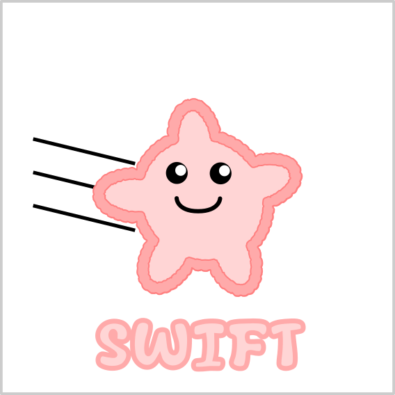
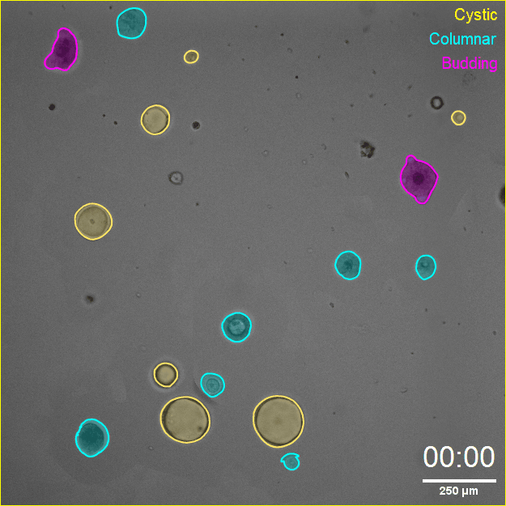
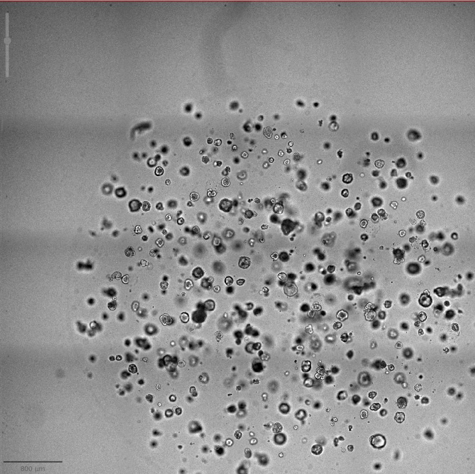
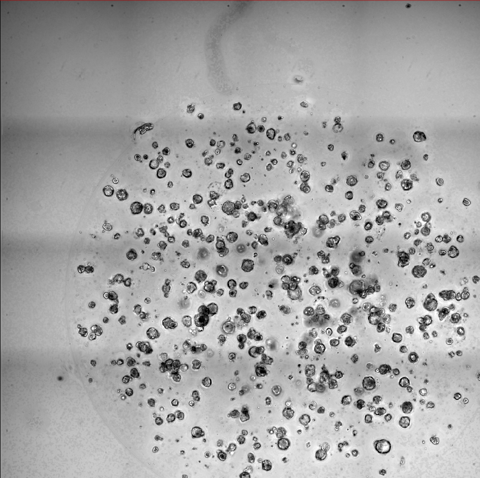
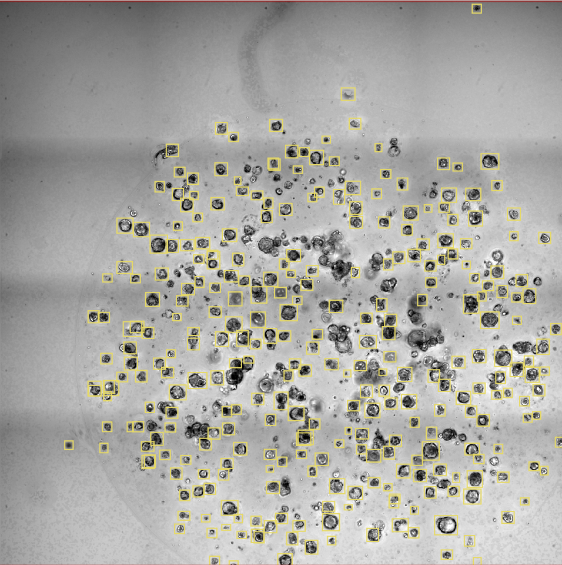
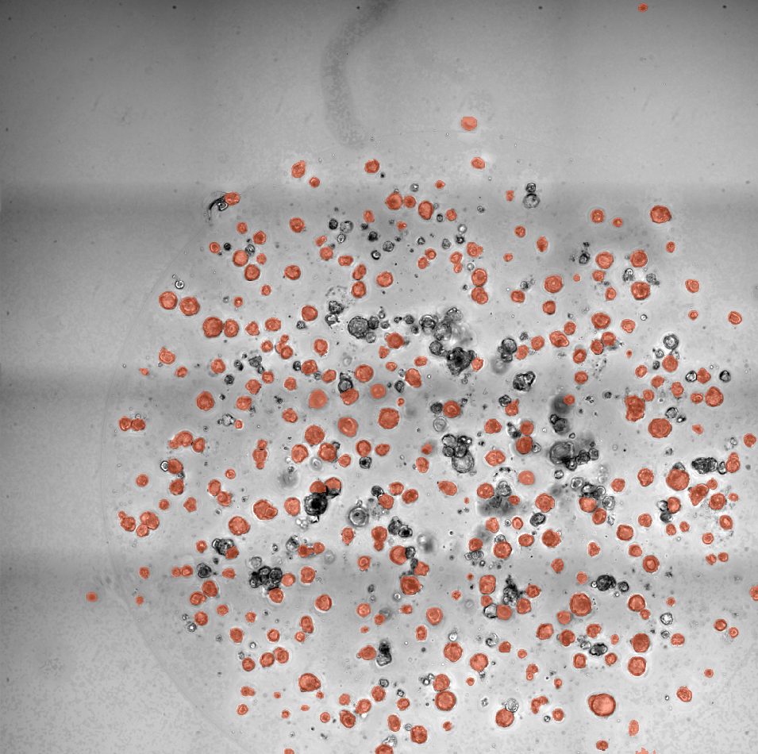

# SWIFT

**S**ingle-organoid **W**orkflow for quantitative **I**maging classi**F**ication and **T**racking 

| | |
|----|----|
| | |


SWIFT was tested and validated on **biop-desktop `0.2.3`**, a Docker image that bundles all required software (Fiji, QuPath, YOLO, SAM server) in a reproducible environment. **This is the recommended route, especially for beginners** — no manual installation of Python environments needed.

## Option A (recommended): biop-desktop Docker image

1. **Install Docker** on your machine: [docker.com/get-started](https://www.docker.com/get-started/). On Windows, install *Docker Desktop* and enable WSL2 when prompted.
2. **Follow the biop-desktop instructions**:
   - [Installation](https://biop.github.io/biop-desktop-doc/installation.html)
   - [Run](https://biop.github.io/biop-desktop-doc/run.html)
3. Pull and run the validated image version:
   ```bash
   docker pull biop/biop-desktop:0.2.3
   ```
4. Once running, you access a full Linux desktop in your browser containing **Fiji**, **QuPath v0.5.1** (with extensions), the **SAM inference server (samapi)** and **YOLO (Ultralytics)** pre-installed at `/opt/conda/envs/yolo`.

> 💡 **Tip:** Mount a local folder when starting the container so your images and QuPath project persist outside Docker (see biop-desktop *Run* documentation).

## Software list (versions used for validation)

| Software | Version | Notes |
|---|---|---|
| [Fiji](https://fiji.sc/) | stable | Update sites: **CLIJ, CLIJx, CLIJ2, PTBIOP** |
| [QuPath](https://qupath.github.io/) | v0.5.1 | With extensions: [qupath-extension-sam](https://github.com/ksugar/qupath-extension-sam), [qupath-extension-biop-omero](https://github.com/BIOP/qupath-extension-biop-omero) (only if using OMERO) |
| [samapi](https://github.com/ksugar/samapi) | 0.6.1 | SAM inference server |
| [YOLO (Ultralytics)](https://docs.ultralytics.com/) | 8.3.119 | In conda env `yolo` |

## Option B: manual installation (advanced users)

If you cannot use Docker, install the components above manually:

1. **Fiji**: download, then activate the update sites *CLIJ, CLIJx, CLIJ2, PTBIOP* (menu `Help > Update... > Manage update sites`).
2. **QuPath v0.5.1**: download the release, then install the extensions by dragging the `.jar` files onto the QuPath window:
   - `qupath-extension-sam` (SAM client)
   - `qupath-extension-biop-omero` (optional, OMERO only)
3. **samapi (SAM server)**: follow the [samapi installation guide](https://github.com/ksugar/samapi). Start the server before running SWIFT — it must listen on `http://localhost:8000/sam/`.
4. **YOLO**: create a conda environment and install Ultralytics:
   ```bash
   conda create -n yolo python=3.10
   conda activate yolo
   pip install ultralytics==8.3.119
   ```
   ⚠️ The SWIFT QuPath script expects the env at `/opt/conda/envs/yolo`. If yours is elsewhere, edit the `envDirPath` variable in `1-QP-Project_Yolo-SAM-zoom.groovy` (in the `runYolo()` helper).

## Download the SWIFT scripts and models

1. Clone or download this repository:
   ```bash
   git clone https://github.com/upvdg/SWIFT.git
   ```
2. Scripts you will use:
   | Script | Software | Purpose |
   |---|---|---|
   | [`0-Fiji-EDF_local.groovy`](0-Fiji-EDF_local.groovy) | Fiji | EDF projection of the active z-stack (local images) |
   | [`0-Fiji-EDF_omero.groovy`](0-Fiji-EDF_omero.groovy) | Fiji | EDF projection in batch from OMERO |
   | [`1-QP-Project_Yolo-SAM-zoom.groovy`](1-QP-Project_Yolo-SAM-zoom.groovy) | QuPath | YOLO detection + SAM segmentation (SWIFT core) |
   | [`2-QP-Convert_SAMannotations_into_detections.groovy`](2-QP-Convert_SAMannotations_into_detections.groovy) | QuPath | Convert SAM annotations to detections, measure, apply classifier |
   | [`1-QP-Export_training_annotation_to_train_YOLO.groovy`](1-QP-Export_training_annotation_to_train_YOLO.groovy) | QuPath | Export bounding boxes to YOLO label format (fine-tuning) |
   | [`2-YOLO_validation.groovy`](2-YOLO_validation.groovy) | QuPath | Evaluate YOLO detections against ground truth (IoU 0.5) |
   | [`SWIFT_tracking.R`](SWIFT_tracking.R) | R | Single-organoid tracking across days ([section 5](#5-optional-add-on-single-organoid-tracking)) |
3. Pre-trained YOLO models (`ModelA.pt` etc.) — place them later inside your QuPath project in a subfolder named `models` (explained in [section 3](#3-detection--segmentation-yolo--sam--swift-core)).

4. ## Example QuPath project & pre-trained models (Zenodo)

A ready-to-use **example QuPath project** is available on Zenodo: [DOI 10.5281/zenodo.XXXXXXX](https://doi.org/10.5281/zenodo.XXXXXXX)

It contains everything needed to test SWIFT end-to-end without any training:
- example **EDF brightfield images** of mouse colon organoids,
- the **pre-trained YOLO models** (in the `models/` subfolder, ready to use with `MODEL_NAME`),
- a **trained object classifier** for the intestinal phenotypes (Cystic, Columnar, Budding, Dying, Ignore), ready to use with `classifier_name` in `2-QP-Convert_SAMannotations_into_detections.groovy`.

To use it: download and unzip the archive, open the `.qpproj` file in QuPath v0.5.1, and follow [section 3](#3-detection--segmentation-yolo--sam--swift-core) — no additional setup needed.

> 📝 If you use the scripts, models or classifier in your work, please cite the Zenodo DOI together with the SWIFT paper.

## Optional: OMERO

SWIFT can read images from and push results (ROIs) to an [OMERO](https://www.openmicroscopy.org/omero/) server. This is **optional** — everything also works with images on a local hard drive. If you don't use OMERO, simply set `DO_PUSH_ANNOTATIONS_ON_OMERO = false` in the QuPath script.

**Next step → [2. Data preparation & EDF projection](#2-data-preparation--edf-projection)**

# 2. Data preparation & EDF projection

Organoids are 3D objects, so brightfield acquisitions are usually **z-stacks**: many organoids are in focus at different planes. SWIFT works on a single sharp 2D image per position, generated by an **Extended Depth of Field (EDF) projection**.

## 2.1 Image acquisition recommendations

These are the settings used in the paper (Nikon Ti2) — adapt to your microscope, SWIFT is microscope-agnostic:

- Transmitted-light brightfield, **10× objective**
- Z-stacks covering the full organoid depth (e.g. 50 µm axial steps)
- Optionally, multi-tile mosaics with ~10% overlap, stitched by the acquisition software
- **Keep exposure, gain, pixel size, and optics identical across samples** if you plan quantitative intensity comparisons

## 2.2 File conversion (if needed)

- Proprietary formats (e.g. Nikon `.nd2`) can be converted to **OME-TIFF** with the [NGFF Converter](https://www.glencoesoftware.com/products/ngff-converter/) or Fiji (Bio-Formats).
- If you use OMERO, upload the converted files to your server at this stage.

## 2.3 EDF projection in Fiji

Two variants of the script are provided — pick one:

- [`0-Fiji-EDF_local.groovy`](0-Fiji-EDF_local.groovy) — processes the **z-stack currently open (active) in Fiji**. Open your image first, then run the script for each stack.
- [`0-Fiji-EDF_omero.groovy`](0-Fiji-EDF_omero.groovy) — **batch mode from OMERO**: give your credentials and the ID of an image, dataset, project, well, plate, or screen; every contained image is fetched, projected, and exported.

Steps:
1. **Start Fiji** (inside biop-desktop or your own installation with CLIJ/CLIJ2/CLIJx/PTBIOP update sites active).
2. Open the chosen script in the Fiji script editor (simply **drag & drop the file onto the Fiji main bar**).
3. Press **Run** and define the parameters:
   - **Sigma (σ)**: radius of the variance filter used to detect the sharpest plane per pixel. **σ = 50 was used in the paper** and is a good starting point for 10× organoid images.
   - **Output directory**: where the projected images are saved.
   - (*OMERO variant*) username, password, object type, and object ID.
4. The script computes a **variance-based EDF projection on GPU (CLIJ2)** and exports **pyramidal OME-TIFFs** (LZW compression) via the Kheops exporter. Output files are named `EDF_sigma-<σ>_<original name>.ome.tiff` — this prefix is recognized by the tracking script later.

**Result:** one crisp 2D brightfield image per well/position, ready for detection.

| Input (one z-plane) | EDF projection |
|---|---|
|  |  |

> 💡 **Naming matters for tracking.** If you plan to use the tracking add-on ([section 5](#5-optional-add-on-single-organoid-tracking)), encode the **timepoint and condition in the image/file name** (e.g. `Timepoint_Condition_Well.ome.tiff`) — the tracking script parses metadata from names.

**Next step → [3. Detection & segmentation (YOLO + SAM)](#3-detection--segmentation-yolo--sam--swift-core)**

# 3. Detection & segmentation (YOLO + SAM) — SWIFT core

This is the heart of SWIFT. In QuPath, a single script:
1. runs **YOLOv8** on each image → one bounding box per organoid (class `Yolo_detection`, yellow),
2. refines each box with **SAM** → precise organoid contour (class `SAM-detection`, magenta),
3. adds shape measurements, and (optionally) pushes everything to OMERO.

## 3.1 Set up the QuPath project

1. **Start the SAM server** (in biop-desktop it is available as a service; manually: start `samapi` so it listens on `http://localhost:8000/sam/`).
2. **Start QuPath** and create a **new project** (`File > Project... > Create project`, choose an empty folder).
3. **Add your EDF images** to the project (drag & drop the OME-TIFFs, or `File > Open URI...` for OMERO images).
4. In the project folder (on disk), **create a subfolder named `models`** and copy your YOLO model into it, e.g. `ModelA.pt`.

```
MyQuPathProject/
├── project.qpproj
├── models/
│   └── ModelA.pt        ← YOLO model goes here
├── yolo_input/          ← created automatically by the script
└── yolo_output/         ← created automatically by the script
```

**Which model?**
| Model | Trained on | Use for |
|---|---|---|
| `ModelA.pt` | Mouse colon organoids | Colon, and works well on PDAC & lung organoids |
| `ModelB.pt` | + mouse small intestine | Highly branched/budding morphologies |
| `ModelC.pt` | + human rectum | Human rectal organoids |

If none fits your organoids well, fine-tune your own in minutes → [section 6](#6-fine-tuning-yolo-for-your-organoids).

## 3.2 Configure the script

1. Open [`1-QP-Project_Yolo-SAM-zoom.groovy`](1-QP-Project_Yolo-SAM-zoom.groovy) and **drag & drop it onto the QuPath window** to open the script editor.
2. Edit the parameters at the top of the script. ⚠️ **The shipped defaults are set for re-running SAM only** — for a full first run you must at least set `MODEL_NAME` and turn detection on:

```groovy
/* YOLO */
def MODEL_NAME = "best.pt"          // ← set to YOUR model file name inside "models/"
def DO_YOLO_DETECTION = false       // ← set to true to run YOLO detection

/* SAM */
def DO_SAM_SEGMENTATION = true
def REMOVE_SAM_SEGMENTATION = DO_SAM_SEGMENTATION  // clears previous SAM objects before re-running
def SAM_DOWNSAMPLE_FACTOR = 1       // keep 1 = segmentation at native resolution
def SAM_TYPE = SAMType.VIT_L        // VIT_L (used in the paper) or SAM2_L
def SAM_OUTPUT = SAMOutput.MULTI_SMALLEST  // script default; MULTI_BEST_QUALITY was used in the paper

/* OMERO (defaults are off — fine for local images) */
def DO_PUSH_ANNOTATIONS_ON_OMERO = false
def DELETE_ROI = false              // delete existing ROIs on OMERO before pushing
def ROIS_OWNER = ""                 // your OMERO username, or "" for all owners
def SHOW_NOTIF = false

/* General */
def DO_CURRENT_IMAGE = false        // true = process only the image open in the viewer
def TEST_MODE = false               // true = SAM on the first 10 boxes only (quick test)
```

> 💡 **First run?** Set `DO_CURRENT_IMAGE = true` and `TEST_MODE = true` to validate the setup on one image in seconds before launching the full batch.

3. Press **Run**. The script loops over every image in the project. Progress is printed in the console (`VERBOSE = true`).

## 3.3 What the script does, step by step

For each image:
1. Clears previous objects, exports a rendered PNG to `yolo_input/`.
2. Runs YOLO in prediction mode (`max_det=500`) from the conda env `/opt/conda/envs/yolo`; box coordinates are written to `yolo_output/predict/labels/`.
3. Imports boxes into QuPath as annotations of class **`Yolo_detection`**.
4. For each box, centers the viewer at downsample = 1 and calls SAM with the box as prompt; the resulting mask becomes an annotation of class **`SAM-detection`**.
5. Adds shape measurements: **Area, Length, Circularity, Solidity, Max/Min diameter**.
6. Saves the image data (and pushes ROIs to OMERO if enabled).

## 3.4 Quality control (recommended)

Organoids touching the image edge are cropped and can bias measurements. Two options:
- Exclude them at the classification step by assigning them to an **Ignore** class ([section 4](#4-optional-add-on-phenotype-classification)) — this is what the paper does; overlapping organoids whose mask is cropped by a front organoid are handled the same way.
- Or delete edge objects manually/by a small script before analysis.

## 3.5 Expected result

| Input EDF | YOLO boxes | SAM masks |
|---|---|---|
|  |  |  |

If you stop here, you already have single-organoid segmentations + morphometrics that you can export (`Measure > Export measurements`) for any downstream analysis.

**Next steps → [4. Classification (optional)](#4-optional-add-on-phenotype-classification) or [5. Tracking (optional)](#5-optional-add-on-single-organoid-tracking)**

# 4. Optional add-on: Phenotype classification

This module assigns each segmented organoid to a **morphological class** using QuPath's built-in **Random Trees object classifier**. It is fully modular: classes depend on your biology, so **the classifier is retrained for each application/dataset** (100–200 annotated organoids per class are enough).

Example from the paper (mouse intestinal organoids): **Cystic**, **Columnar**, **Budding**, **Dying**, plus an **Ignore** class for cropped/edge objects excluded from analysis.

## 4.1 Convert SAM annotations to detections

QuPath object classifiers work on **detections**, while SWIFT masks are **annotations**. The script [`2-QP-Convert_SAMannotations_into_detections.groovy`](2-QP-Convert_SAMannotations_into_detections.groovy) does the conversion. On each image it:

1. **clears all existing detections** (⚠️ re-running deletes previously classified detections),
2. duplicates every `SAM-detection` annotation as a **detection** object,
3. adds shape measurements (Area, Length, Circularity, Solidity, Max/Min diameter),
4. adds intensity measurements (**Mean, SD, Min, Max, Median** at 2 µm/px, 25 µm tiles) via the Intensity Features plugin,
5. **applies the object classifier** named in the `classifier_name` variable (default `"myObjClassifier"`).

These morphometric + intensity features are exactly what the classifier learns from.

**First pass (no classifier trained yet):** comment out the last line (`runObjectClassifier(classifier_name)`), then press **Run** (or `Run > Run for project` for all images) to generate measured detections you can annotate for training.

## 4.2 Annotate training examples

1. Create your classes: `Annotations` tab → three-dot menu → `Add class` (e.g. Cystic, Columnar, Budding, Dying, Ignore).
2. On a few representative images, **click detections and assign them a class** (right-click → `Set class`, or select + click the class in the Annotations tab).
3. Aim for **100–200 organoids per class**, covering the diversity of your dataset (sizes, days, media...). Assign cropped/edge organoids to **Ignore**.

## 4.3 Train the classifier

1. Menu `Classify > Object classification > Train object classifier`.
2. Settings used in the paper:
   - **Classifier type:** Random Trees (RTrees)
   - **Features:** all shape + intensity measurements added in 4.1
   - Advanced (RTrees): **50 trees, max depth 25, min 10 samples per split**; surrogate splits and cross-validation off
3. Click **Live update** to preview predictions, iterate on annotations until satisfied, then **Save** the classifier with a clear name (e.g. `intestinal_5classes_2026-08`).

> 📝 **Document it.** Note the classifier name, training images, and number of annotations per class in a `README` inside your project — future-you will thank you.

## 4.4 Apply the classifier to the whole project

1. In [`2-QP-Convert_SAMannotations_into_detections.groovy`](2-QP-Convert_SAMannotations_into_detections.groovy), set `classifier_name` to the name you saved in 4.3 (and un-comment `runObjectClassifier` if you commented it in 4.1).
2. `Run > Run for project` — each image gets converted, measured, and classified in one pass.
3. Export results: `Measure > Export measurements` → select all images, type **Detections**, separator **semicolon**. This CSV is the input of the tracking module ([section 5](#5-optional-add-on-single-organoid-tracking)).

## 4.5 Validate

Compare classifier predictions vs. manual annotations on a held-out set (confusion matrix). In the paper, the intestinal classifier reached **recall > 0.94 and F1 > 0.95** per class. Exclude the `Ignore` class from downstream phenotypic analysis.

**Next step → [5. Optional add-on: Tracking](#5-optional-add-on-single-organoid-tracking)**

# 5. Optional add-on: Single-organoid tracking

This module links individual organoids across **consecutive imaging days** using the R script [`SWIFT_tracking.R`](SWIFT_tracking.R) to reconstruct trajectories of growth and phenotype transitions (e.g. cystic → budding). It outputs a ready-to-analyze **Excel workbook** (one sheet per measurement + a summary sheet).

## 5.1 Requirements

**R** (≥ 4.x) with:
```r
install.packages(c("readr","dplyr","stringr","tidyr","purrr","openxlsx"))
```

## 5.2 Input: a single QuPath measurement export

Export **all detections of all images and days into one CSV** (`Measure > Export measurements`, type *Detections*, separator *semicolon*). Required columns (produced automatically by SWIFT, see sections 3–4):

- `Image`, `Object ID`, `Classification`, `Centroid X µm`, `Centroid Y µm`
- Measurements: `Area µm^2`, `Length µm`, `Circularity`, `Solidity`, `Max diameter µm`, `Min diameter µm`, and the intensity features `ROI: 2.00 µm per pixel: Channel_0: Mean / Std.dev. / Min / Max / Median`

### ⚠️ Image naming convention (critical)

The script parses **day, sample ID, well, condition, and replicate from the image name**. Expected pattern (the `EDF_sigma-<σ>_` prefix is produced automatically by the EDF scripts):

```
EDF_sigma-50_..._day4_12_MediumB_..._003.ome.tiff
              │    │   │  │            │
              │    │   │  │            └─ Replicate: 3 digits before ".ome"
              │    │   │  └─ Condition block: up to 5 "_"-separated tokens
              │    │   └─ Sample_ID: number after "day4_" (e.g. mouse/donor)
              │    └─ Day: "day" + number (day4, day5, ...)
              └─ Prefix removed by the script ("EDF_sigma-<σ>_", any σ)
```

If your naming differs, adapt the regular expressions in **section 2 of the script** (`str_extract`/`str_match` calls) — this is the most common thing to edit.

## 5.3 Configure & run

All settings are grouped in the **USER PARAMETERS block (section 0)** at the top of the script — this is normally the only part you edit:

| Parameter | Meaning | Default |
|---|---|---|
| `INPUT_CSV`, `CSV_DELIM` | QuPath export file and its delimiter | `measurements.csv`, `";"` |
| `OUTPUT_XLSX` | Output Excel file | `SWIFT_tracking_results.xlsx` |
| `DAYS` | Consecutive timepoints to track (2 or more, any days) | `c(4, 5, 6)` |
| **`MAX_DISTANCE_UM`** | Max centroid displacement (µm) between consecutive days | 150 µm (as in the paper — calibrate on your own day-to-day displacements, see §5.6) |
| `IMAGE_PREFIX_REGEX` | File-name prefix stripped before parsing (e.g. Fiji EDF prefix) | `"^EDF_sigma-\\d+_"` |
| `MEASUREMENTS` | QuPath measurement columns to export | SWIFT defaults |
| `EXCLUDE_CLASSES_FROM_MEANS` | Classes excluded from mean measurements in the Summary sheet (counts/% still include them) | `c("Dying")` — use `c()` to exclude none |

If your image naming deviates from the convention above, additionally adapt the regular expressions in **section 2** (commented line by line).

Then run the whole script (`Source`). Set your working directory to the folder containing the CSV first (`setwd(...)` or an RStudio project).

## 5.4 How the tracking works

1. **Candidate links** — within each image (well), all object pairs between consecutive days are generated and the Euclidean centroid distance `d = √((xⱼ−xᵢ)² + (yⱼ−yᵢ)²)` is computed.
2. **Gating** — pairs with d ≤ threshold are kept. The threshold intentionally accommodates small plate-repositioning offsets between days in addition to biological movement.
3. **Greedy one-to-one assignment** — candidates are ranked by increasing distance; each object is linked at most once (`!duplicated`). Links between consecutive day pairs are then chained via shared intermediate IDs; tracks terminate early when no valid continuation exists (organoid disappeared or moved beyond the threshold — later-day columns are then `NA`).
4. **Metadata merge** — all per-day measurements, classes, and centroid coordinates are merged back into each trajectory.

## 5.5 Output

One Excel workbook containing:
- **One sheet per measurement** (Area, Circularity, Mean intensity, ...): rows = tracked organoids; columns = metadata (Well, Sample_ID, Conditions, Replicate), per-day coordinates, per-day classes, **link distances (`Dist_4_5`, ...)** for threshold calibration, and the per-day values of that measurement → ideal for single-organoid growth curves and transition analyses.
- **A "Summary" sheet**: per well/condition/day — object counts and % per class, and mean of each measurement. By default means exclude the `Dying` class (set via `EXCLUDE_CLASSES_FROM_MEANS`).

## 5.6 Good practice

- Keep plate orientation and imaging positions as constant as possible between days; image at the same time each day.
- Before trusting bulk statistics, calibrate the distance threshold (plot the `Dist_4_5` column distribution) and visually verify a handful of tracks in QuPath.
- 📝 Keep the exact script version and threshold used alongside each analysis for reproducibility.

**See also → [6. Fine-tuning YOLO](#6-fine-tuning-yolo-for-your-organoids) · [7. Troubleshooting & FAQ](#7-troubleshooting--faq)**

# 6. Fine-tuning YOLO for your organoids

If detection with the provided models is unsatisfactory on your organoid type, fine-tune YOLO with **very few annotations** — in the paper, 18 organoids (mouse small intestine) and 153 (human rectum), i.e. **minutes of annotation**, were enough to restore high precision/recall.

## 6.1 Annotate in QuPath

1. Create a QuPath project with representative **EDF images** of your organoids (vary media, days, sizes, brightness for generalizability).
2. Draw a **rectangle (bounding box)** around every organoid using the rectangle tool. Rules used in the paper for consistency:
   - do **not** annotate organoids touching the image edge,
   - do **not** annotate objects below a minimal size threshold,
   - annotate *all* other organoids in the image (missed ones = false "negatives" during training).
3. A small, diverse dataset works: the paper's Model A was trained on **417 organoids across 16 images** (9 training / 7 validation).

## 6.2 Export annotations to YOLO format

1. Open [`1-QP-Export_training_annotation_to_train_YOLO.groovy`](1-QP-Export_training_annotation_to_train_YOLO.groovy) in QuPath. For each annotated image (run it on the current image, or `Run > Run for project`), it writes a YOLO label file `<image name>.txt` (single class `organoid`, normalized coordinates) into a `YOLO_labels/` folder inside the project.
2. Export the matching **images** (e.g. `File > Export images... > Rendered RGB (PNG)`), then arrange the YOLO folder structure and write a `data.yaml`, e.g.:
   ```yaml
   path: /path/to/dataset
   train: images/train
   val: images/val
   names:
     0: organoid
   ```
   with your PNGs in `images/train|val` and the exported `.txt` files in `labels/train|val` (same base names).

## 6.3 Train

In a terminal with the `yolo` conda env active:

```bash
yolo detect train \
    data="path/to/data.yaml" \
    model=yolov8s.pt \
    epochs=70 \
    imgsz=1024 \
    augment=true
```

Settings used in the paper: **YOLOv8s**, 70 epochs, input size 1024×1024, RandAugment data augmentation, AdamW optimizer (lr 0.002, momentum 0.9). Training runs even on CPU (Model A was trained on an Apple M1 Pro).

The best weights are saved as `runs/detect/train/weights/best.pt` — rename it (e.g. `MyOrganoids_v1.pt`), copy it to your QuPath project's `models/` folder, and set `MODEL_NAME` accordingly ([section 3](#3-detection--segmentation-yolo--sam--swift-core)).

## 6.4 Evaluate

- Ultralytics prints **precision, recall, mAP50** on the validation set after training. As a reference, Model A reached precision 0.67 / recall 0.83 / mAP50 0.76 on validation and recall 0.92 on an independent dataset.
- For per-object evaluation against manual ground truth in QuPath, use [`2-YOLO_validation.groovy`](2-YOLO_validation.groovy): assign your ground-truth annotations to a class named **`GT`**, run YOLO detection (class `Yolo_detection`), then run the script — it matches objects at **IoU ≥ 0.5** and prints TP, FP, FN, precision, recall, F1 and an approximate mAP@0.5.

> 📝 **Traceability:** keep `data.yaml`, the training images list, and the exact training command together with each model version.

# 7. Troubleshooting & FAQ

## Setup

**"Error: no YOLO boxes found in the image ..."**
- Check that the model file exists at `YourProject/models/<MODEL_NAME>` and that `MODEL_NAME` matches exactly (case-sensitive).
- Check that `DO_YOLO_DETECTION = true` — the script's shipped default is `false` (SAM-only mode).
- Check the QuPath console for the YOLO command output — a Python/conda error means the env path is wrong. Edit `envDirPath` (`/opt/conda/envs/yolo` by default) in the script's `runYolo()` helper.
- It can also simply mean YOLO detected nothing: try a different model or fine-tune ([section 6](#6-fine-tuning-yolo-for-your-organoids)).

**SAM step hangs or fails**
- Is the SAM server running and reachable at `http://localhost:8000/sam/`? Test the URL in a browser.
- samapi version tested: **0.6.1**. GPU strongly speeds up SAM but CPU works.
- The script waits ~100 ms between boxes for the viewer to center; on slow machines, increase this `sleep(100)` value.

**"Your image is not from OMERO" error**
- You have `DO_PUSH_ANNOTATIONS_ON_OMERO = true` but your images are local. Set it to `false`.

**Script seems to skip images / viewer doesn't update**
- The script drives the QuPath viewer and uses pauses (`SLEEP_TIME = 1000` ms) between images. On slow systems, increase `SLEEP_TIME`.

## Detection & segmentation quality

**Many organoids missed, or boxes on debris**
- Fine-tune with a few annotations of your organoid type — this is fast and usually solves it ([section 6](#6-fine-tuning-yolo-for-your-organoids)).
- Check your EDF projection quality first (blurry input → poor detection). Try adjusting σ ([section 2](#2-data-preparation--edf-projection)).

**Overlapping organoids: one mask is cropped**
- Expected behavior: SAM segments the front organoid fully; the one behind gets a cropped mask. Assign cropped objects to the **Ignore** class in the classifier so they're excluded ([section 4](#4-optional-add-on-phenotype-classification)) — or keep them, depending on your analysis.

**Segmentation looks coarse or grabs the wrong object**
- Make sure `SAM_DOWNSAMPLE_FACTOR = 1` (native resolution).
- Try switching `SAM_OUTPUT` between `MULTI_SMALLEST` (script default) and `MULTI_BEST_QUALITY` (used in the paper).

## Classification & tracking

**My classified detections disappeared**
- `2-QP-Convert_SAMannotations_into_detections.groovy` starts with `clearDetections()` — re-running it deletes previous detections before recreating them. Re-apply the classifier afterwards.

**Classifier confuses two classes**
- Add more training examples specifically of the confused morphologies, ideally from the images where errors occur, and retrain. Check that intensity features were computed (the convert script must have run).

**Tracks jump between different organoids**
- Your day-to-day displacement exceeds the 150 µm gate, or plate repositioning is too variable. Measure typical displacements in your data and adjust `MAX_DISTANCE_UM` ([section 5](#5-optional-add-on-single-organoid-tracking)).

## General

**Can I use SWIFT on other organoid types / microscopes?**
Yes — the core was benchmarked without retraining on human PDAC and lung organoids from independent labs/microscopes, and adapted to mouse small intestine and human rectum with minutes of extra annotation.

**Do I need a GPU?**
No, but it helps. YOLO inference and training run on CPU (≈0.5 s/image inference); SAM is much faster on GPU.

**Where do I ask questions?**
Open an [issue](../../issues) on this repository.
